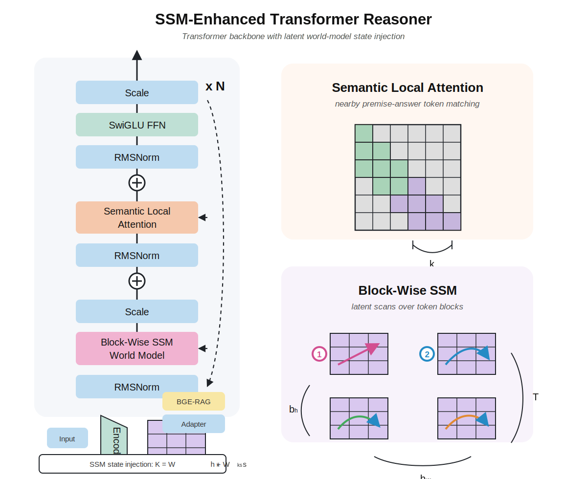

# IJCNN-Qiwei

Retained Type 1 architecture:

```text
premises + answer candidate
↓
Type 1 question grouping
  - mcq vs judgment
  - conclusion / entailment / qualification / truth task
  - fact_match / rule_chain / negation / uncertainty_gap logic shape
↓
BGE external vector memory retrieves recurring failure-mode semantics
  - quantifier
  - symbolic
  - numeric
  - open_ended_invalid
↓
construct multiple possible worlds / possible theories
  - support world
  - contradiction world
  - uncertainty world
  - rule-chain world
  - candidate prior world
↓
WM/SSM imagines world transitions
  - observe
  - propose support world
  - test forward explanation
  - compare counter-world
  - refute/suspend/backtrack
  - rank answer probability
↓
retrieved RAG features are appended into every world-transition step
↓
SSM world model emits latent search states for each RAG-enriched trace step
↓
candidate token + trace-step Transformer reads modal-abductive world traces
↓
repeated reasoning block:
  AdaLN -> Block-Wise SSM -> Scale residual
  AdaLN -> Frame/Token Local Attention -> Scale residual
  AdaLN -> SwiGLU FFN -> Scale residual
↓
candidate-level Transformer compares answer candidates
↓
answer probability distribution
```

The old comparison branches, Z3 path, global SAT graph path, explicit trace auxiliary
path, pooled implicit flow, token mutual SSM, external world-model pipeline,
and candidate Transformer comparison paths are no longer retained.

## Research-Style Model Figure



The retained model is best described as a Transformer backbone with reasoning
state injection. Compared with a traditional Transformer, the main changes are:

```text
Traditional Transformer:
token embedding -> self-attention -> FFN -> output head

Retained Qiwei architecture:
token embedding
  + type-specific adapter
  + BGE-RAG semantic memory
  + SSM / world-model latent reasoning state
  + SSM state injected into Transformer attention
  + proof/consistency regularization
  -> answer probability distribution
```

The key architectural change is that the Transformer attention does not only
use the token hidden state. The SSM world model first scans premise-answer
reasoning blocks and emits a latent state `s_i`. This state is injected into the
attention key:

```text
K_i = W_k h_i + W_ks s_i
```

Here `h_i` is the normal Transformer token representation and `s_i` is the
world-model reasoning state. This lets the attention layer condition on both
surface token semantics and latent premise-to-answer reasoning flow.

## Best Result

```text
architecture: type1_modal_abductive_proof_state_possible_world_trace_ssm_bge_rag_transformer
rag_backend: bge
bge_model: BAAI/bge-small-en-v1.5
train_questions: 642
validation_questions: 162
train_accuracy: 0.883178
validation_accuracy: 0.82716
consistency_loss_weight: 0.10
```

This version keeps Type 1 and Type 2 on the same method family: modal-abductive
possible-world traces plus BGE-RAG, SSM/WM trace encoding, and the same
Transformer reasoner. Type 1 uses natural-language premise evidence to build
small support/counterfactual/uncertainty worlds, then exposes proof-state
features to the Transformer: selected premise evidence, rule application,
intermediate fact support, option-vs-option counter-world margin, and belief
reward. Type 2 uses FOL-style symbolic premises to build the same kind of
possible-world transition trace.

Validation highlights:

```text
retained accuracy: 0.82716
best validation groups include mcq:choice_selection:rule_chain:closed = 1.0
and mcq:conclusion_selection:negation:closed = 1.0
remaining weak group: mcq:conclusion_selection:fact_match:closed = 0.0
```

Best artifacts:

```text
type1_backtracking_trace_best_eval_summary.json
type1_backtracking_trace_best_eval_results.json
type1_backtracking_trace_best_model.json
```

Current error analysis:

```text
wrong validation questions: 28
largest expected->predicted errors: Yes->No 6, A->Uncertain 5, No->Yes 4,
No->Uncertain 4
```

## Type 2 Modal-Abductive Trial

Type 2 is currently wired as symbolic/formal-logic questions: rows whose
question/options contain `∀`, `∃`, `¬`, `→`, `ForAll`, `Exists`, `forall`,
`exists`, or predicate expressions such as `P(x)`. The retained Type 2 path now
constructs multiple possible worlds/theories for each answer candidate. The
WM/SSM imagines forward support and contradiction/backtracking transitions on
that world graph, then the Transformer reads the modal transition trace and
outputs the answer probability distribution.

```text
architecture: type2_modal_abductive_possible_world_trace_ssm_bge_rag_transformer
symbolic_questions: 212
train_questions: 174
validation_questions: 38
train_accuracy: 0.775862
validation_accuracy: 0.842105
rag_backend: bge
bge_model: BAAI/bge-small-en-v1.5
consistency_loss_weight: 0.0
```

Type 2 validation errors:

```text
wrong validation questions: 6
wrong transitions: A->Uncertain 2, Yes->No 2, C->Uncertain 2
main issue: remaining errors are still conservative on MCQ answers and some
Yes truth statements.
```

## LLM Fallback

LLM fallback runs after the retained WM+SSM+Transformer prediction in the Type 1
and legacy Type 2 entrypoints. It is disabled by default. When enabled, it only
calls the LLM if the model is low confidence or predicts `Uncertain`; otherwise
the retained model answer is used directly. The current modal-abductive Type 2
entrypoint is evaluated without fallback.

Default fallback settings:

```text
model: minigpt
api_key_env: MINIGPT_API_KEY
base_url: https://api.openai.com/v1
trigger: top_probability < 0.62 or predicted_answer == Uncertain
```

Prediction rows record both answers:

```text
model_predicted_answer: retained model output
predicted_answer: final output after optional fallback
fallback_used: whether the LLM answer replaced the model answer
fallback_reason: low confidence / uncertain trigger
fallback_error: API/key/parse error, if fallback failed
```

## Run

Install dependencies:

```bash
pip install -r requirements.txt
```

Smoke test:

```bash
python3 run_type1_modal_abductive_training.py \
  --input ../Logic_Based_Educational_Queries.json \
  --rag-backend bge \
  --bge-model BAAI/bge-small-en-v1.5 \
  --limit-records 24 \
  --epochs 2 \
  --batch-size 4 \
  --hidden-dim 64 \
  --transformer-layers 1 \
  --transformer-heads 4 \
  --transformer-ff-dim 128 \
  --max-trace-steps 14 \
  --ssm-block-size 4 \
  --local-attention-window 4 \
  --consistency-loss-weight 0.10
```

Type 2 modal-abductive trial:

```bash
python3 run_type2_modal_abductive_training.py \
  --input ../Logic_Based_Educational_Queries.json \
  --rag-backend bge \
  --bge-model BAAI/bge-small-en-v1.5 \
  --epochs 30 \
  --batch-size 16 \
  --hidden-dim 128 \
  --transformer-layers 2 \
  --transformer-heads 4 \
  --transformer-ff-dim 256 \
  --max-trace-steps 18 \
  --ssm-block-size 8 \
  --local-attention-window 8 \
  --consistency-loss-weight 0.0
```

Full retained training/evaluation:

```bash
python3 run_type1_modal_abductive_training.py \
  --input ../Logic_Based_Educational_Queries.json \
  --rag-backend bge \
  --bge-model BAAI/bge-small-en-v1.5 \
  --epochs 30 \
  --learning-rate 0.0007 \
  --l2 0.001 \
  --hidden-dim 128 \
  --transformer-layers 2 \
  --transformer-heads 4 \
  --transformer-ff-dim 256 \
  --dropout 0.15 \
  --batch-size 16 \
  --patience 12 \
  --train-ratio 0.8 \
  --random-state 42 \
  --max-trace-steps 18 \
  --ssm-block-size 8 \
  --local-attention-window 8 \
  --propagation-top-k 4 \
  --implicit-bias-strength 0.18 \
  --consistency-loss-weight 0.10 \
  --output type1_backtracking_trace_best_eval_results.json \
  --summary-output type1_backtracking_trace_best_eval_summary.json \
  --model-output type1_backtracking_trace_best_model.json
```

Consistency evaluation:

```bash
python3 run_type1_consistency_evaluation.py \
  --input ../Logic_Based_Educational_Queries.json \
  --retained-results type1_backtracking_trace_best_eval_results.json \
  --output type1_consistency_eval_results.json \
  --summary-output type1_consistency_eval_summary.json
```

Add `--ungrouped-batches` to either command to disable group-wise feeding while
keeping the question-type features in the tensors.

Information-flow diagnostics:

```bash
python3 run_type1_information_flow_diagnostics.py \
  --input ../Logic_Based_Educational_Queries.json \
  --model type1_backtracking_trace_best_model.json \
  --output type1_information_flow_diagnostics.json
```

Current diagnostic result:

```text
normal_accuracy: 0.771605
zero_trace_accuracy: 0.728395
shuffle_trace_accuracy: 0.734568
zero_candidate_accuracy: 0.592593
disable_causal_bias_accuracy: 0.771605
zero_trace_tv_delta: 0.117064
shuffle_trace_tv_delta: 0.124141
zero_candidate_tv_delta: 0.317907
trace_to_candidate_grad_ratio: 0.116348
interpretation: Trace/SSM information affects predictions.
```

## EXACT 2026 API Interface

The competition requires one public prediction endpoint for both Type 1 and
Type 2:

```text
POST /predict
Content-Type: application/json
```

The implemented interface is:

```text
run_exact_api.py
ijcnn_qiwei/exact_api.py
```

The endpoint does not fuse Type 1 and Type 2 and does not infer the type. The
test request already provides the `type` field, so the API uses hard routing:

```text
type == "type1" -> Type 1 logic solver prompt
type == "type2" -> Type 2 physics solver prompt
```

It accepts the unified EXACT schema:

```json
{
  "query_id": "T1_0001",
  "type": "type1",
  "query": "Is Student A eligible for graduation?",
  "premises": ["A student with at least 120 credits is eligible.", "Student A has completed 118 credits."],
  "options": ["Yes", "No", "Uncertain"]
}
```

It always returns a JSON list with one result object:

```json
[
  {
    "query_id": "T1_0001",
    "answer": "No",
    "unit": "",
    "explanation": "Student A has 118 credits, below the 120 required, so not eligible.",
    "premises_used": [0, 1],
    "reasoning": {
      "type": "fol",
      "steps": ["118 < 120", "not eligible"]
    }
  }
]
```

Run the vLLM model server first:

```bash
export VLLM_MODEL=Qwen/Qwen2.5-7B-Instruct
bash scripts/vllm_serve_example.sh
```

The committee verifies the model through:

```text
GET http://<your-vllm-host>:8000/v1/models
```

Then run the EXACT prediction API:

```bash
export VLLM_BASE_URL=http://127.0.0.1:8000/v1
export VLLM_MODEL=Qwen/Qwen2.5-7B-Instruct
uvicorn run_exact_api:app --host 0.0.0.0 --port 8080
```

Your submitted `urls.txt` should contain:

```text
prediction_url=https://<your-public-host>/predict
vllm_models_url=https://<your-vllm-host>/v1/models
```

Local contract check:

```bash
python3 scripts/check_exact_api_contract.py
```

Submission helper files:

```text
urls.txt.template
notation_mapping.csv
.env.example
```
